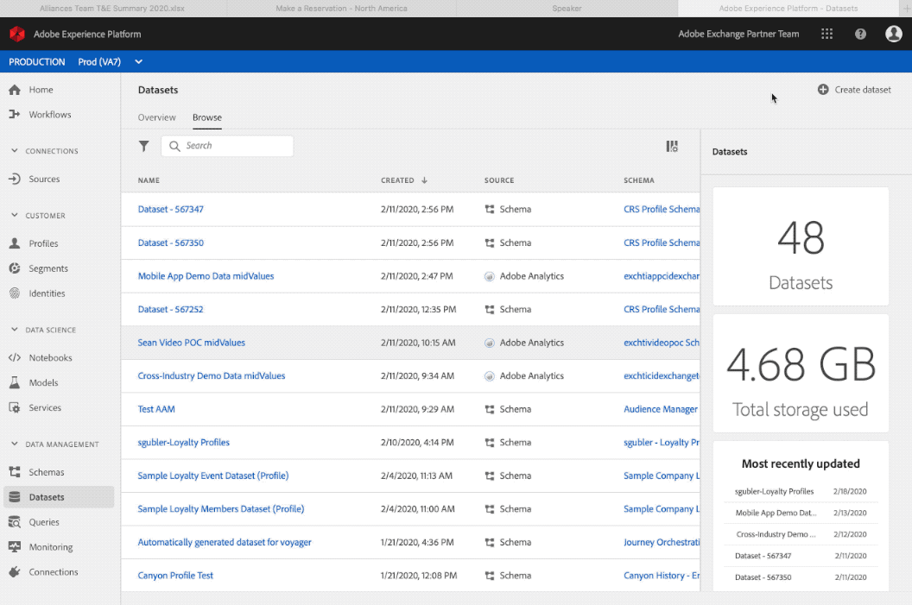

# Creación de esquemas y conjuntos de datos

El [Colección Postman](https://github.com/Adobe-Marketing-Cloud/exchange-aep-profile-integration-postman) se hace referencia a en todo el artículo mediante las llamadas asociadas por número. Encontrará más información sobre la instalación y el uso de la colección Postman en Github [LÉAME](https://github.com/Adobe-Marketing-Cloud/exchange-aep-profile-integration-postman/blob/master/README.md) página. También hay conjuntos de datos de ejemplo de [fidelidad](https://github.com/Adobe-Marketing-Cloud/exchange-aep-profile-integration-postman/blob/master/AEP%20loyalty%20events.json) y [perfil](https://github.com/Adobe-Marketing-Cloud/exchange-aep-profile-integration-postman/blob/master/AEP%20loyalty%20profiles.json) datos.

## Esquemas

Un esquema es un conjunto de reglas que representan y validan la estructura y el formato de los datos. En un nivel superior, los esquemas proporcionan una definición abstracta de un objeto del mundo real (como una persona) y describen qué datos deben incluirse en cada instancia de ese objeto (como nombre, apellido, cumpleaños, etc.). Los esquemas se pueden crear en la interfaz de usuario o mediante la variable [!DNL Experience Platform] API.

Consulte [esta documentación](https://www.adobe.io/apis/experienceplatform/home/xdm/xdmservices.html#!api-specification/markdown/narrative/technical_overview/schema_registry/schema_composition/schema_composition.md) para obtener más información.

### Creación de un esquema

Los socios pueden crear un esquema con la interfaz de usuario siguiendo este procedimiento [tutorial](https://docs.adobe.com/content/help/es-ES/experience-platform/xdm/tutorials/create-schema-ui.html). Este ejemplo utiliza el esquema de perfil del programa de fidelización. Aunque el ejemplo es un esquema de perfil, los esquemas basados en eventos se pueden utilizar con un proceso similar.

Para utilizar las API, los socios deben tener una integración de Adobe I/O existente con [!DNL Experience Platform] permisos activados. Consulte esta guía para [creación de una integración de E/S](https://www.adobe.io/apis/experienceplatform/home/tutorials/alltutorials.html#!api-specification/markdown/narrative/tutorials/authenticate_to_acp_tutorial/authenticate_to_acp_tutorial.md).

Después visite [este vínculo](https://docs.adobe.com/content/help/en/experience-platform/xdm/tutorials/create-schema-api.html) para aprender a crear esquemas utilizando la API.

Para crear un esquema mediante Postman, utilice las llamadas contenidas en folders 1: Create Schema, 1a: Create Schema for PROFILE data O 1b: Create Schema for EVENT data.

## Conjuntos de datos

Todos los datos que se ponen en Adobe [!DNL Experience Platform] está contenido en conjuntos de datos. Un conjunto de datos es una construcción de almacenamiento y administración para una colección de datos, normalmente una tabla, que contiene un esquema (columnas) y campos (filas). Los conjuntos de datos también contienen metadatos que describen varios aspectos de los datos que almacenan.

El servicio de catálogo es el sistema de registro para la ubicación y el linaje de datos dentro de [!DNL Experience Platform]y se utilizan para crear y administrar conjuntos de datos. El catálogo rastrea los metadatos de cada conjunto de datos, que incluyen una referencia al esquema del Modelo de datos de experiencia (XDM) al que se ajusta el conjunto de datos (explicado en la siguiente sección) y el número de registros ingeridos en ese conjunto de datos.

Ir [aquí](https://docs.adobe.com/content/help/en/experience-platform/catalog/datasets/overview.html) para obtener una descripción general detallada del conjunto de datos.

### Crear un conjunto de datos

<!-- 
We don't yet support hover text in images (and we render it poorly when included). I removed "Creating a Dataset" from the above image link. We can add it back when we support it (Summer 2020?) -Bob
-->

Cree un conjunto de datos a través de la IU:

1. Clic **[!UICONTROL Crear conjunto de datos]**.

1. Clic **[!UICONTROL Crear desde esquema]**.

1. Haga clic en **[!UICONTROL Finalizar]**.

Ir [aquí](https://docs.adobe.com/content/help/en/experience-platform/catalog/datasets/user-guide.html) para obtener una guía del usuario del conjunto de datos.

[Creación de un conjunto de datos mediante las API](https://docs.adobe.com/content/help/en/experience-platform/catalog/datasets/create.html).

Para crear un conjunto de datos a través de Postman, utilice las carpetas 2: Crear conjunto de datos, 2a: Crear conjunto de datos para datos de PERFIL O 2b: Crear conjunto de datos para datos de EVENTO.

## Prácticas recomendadas de esquemas y conjuntos de datos para socios

* Los datos del socio deben utilizar un esquema de perfil independiente en lugar de crear un mix-in para el esquema de perfil y el esquema de experiencia existentes de un cliente.
* Los socios deben utilizar clases de Adobe y mezclas siempre que sea posible.
* Los socios deben cargar sus datos mediante un conjunto de datos independiente en lugar de intentar combinar sus datos en uno existente.
* Por ahora, los socios no pueden cargar sus esquemas en el registro global.
